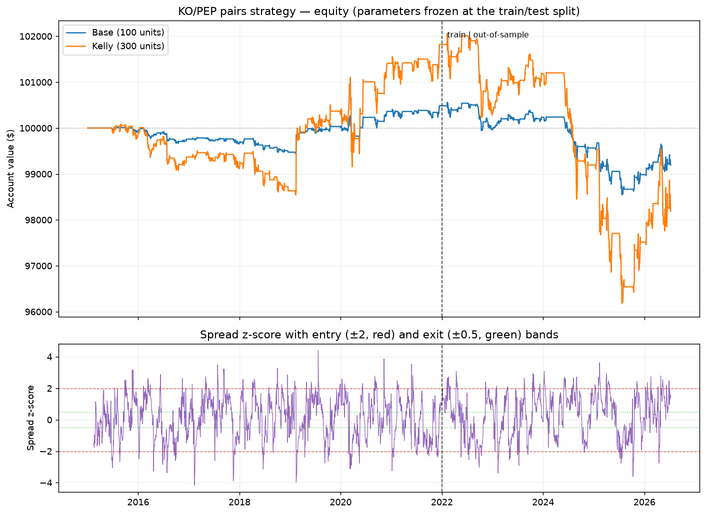

# Backtesting Engine & Strategy Study: Mean-Reversion vs. Momentum

An event-driven backtesting engine built from scratch, used to run a controlled
comparison of the two great opposing strategy archetypes — **mean-reversion**
(pairs trading) and **momentum** (trend-following) — under identical, rigorous
conditions: no lookahead, realistic costs, strict out-of-sample validation, and
honest reporting.

*Both strategies over the full period, indexed to $100, with parameters frozen at
the train/test split (dashed line). Pairs (top) shows a faint edge before the
split that inverts after; momentum (bottom) is flat before and positive after —
mirror images.*

## Headline result

**Neither strategy had a durable edge — performance was regime-dependent.**

| Strategy | In-sample Sharpe (2015-21) | Out-of-sample Sharpe (2022+) |
|---|---:|---:|
| Pairs (mean-reversion) | +0.20 | **-0.50** |
| Momentum (trend) | +0.08 | **+0.39** |

The two strategies were near mirror images. The pairs trade had a faint in-sample
edge that **inverted** out-of-sample; momentum did nothing in-sample but turned
**positive** out-of-sample (a result robust across every parameter setting, though
confined to the single 2022+ window). The calmer 2015-21 regime leaned
reversion-friendly; the higher-dispersion 2022+ regime (rate shock, energy run)
leaned trend-friendly. A strategy that worked in one period failed in the other.

This project demonstrates the full quantitative process working correctly —
including the parts most backtests skip: testing honestly, distrusting your own
good-looking numbers, and reporting that the edges aren't durable.

## Why this project

I study data science with a math minor and don't take finance courses. Building
this was how I learned the practical machinery of quant finance — risk, edge
estimation, and position sizing — extending a poker bot I wrote earlier (same core
idea: find an edge, estimate it, size the bet accordingly).

## The engine (what makes it trustworthy)

The backtest is **event-driven**: it walks through time one bar at a time and
passes events down a strict one-way chain:

    MarketEvent -> SignalEvent -> OrderEvent -> FillEvent

Information only ever flows forward. The data handler exposes prices through a
**cursor** that slices history at "today," so a strategy **cannot** read future
prices even by mistake — the difference between a backtest you *hope* is honest
and one that *can't* cheat.

Key features:
- **Structural no-lookahead** — enforced in code, not by convention.
- **Next-bar execution** — orders decided on today's close fill at tomorrow's
  price, removing the "trade at the price you just saw" bias.
- **Realistic costs** — per-share commission ($1 min) and adverse slippage (5 bps).
- **Signed-quantity accounting** — shorting requires no special-case logic.
- **Strategy-agnostic** — the same engine runs a two-asset pairs trade and a
  ten-asset momentum portfolio without modification.
- **Honest performance module** — Sharpe, Sortino, drawdown, and time-underwater,
  not the misleading headline total return.

## The two strategies

**Pairs trading (mean-reversion).** Trade the spread between two cointegrated
assets. When the spread stretches unusually far (a rolling z-score beyond ±2),
bet it reverts — short the rich leg, long the cheap leg — and close when it
returns to normal. Positions sized with the Kelly criterion. Bets that gaps
*revert*.

**Cross-sectional momentum (trend).** Each month, rank the whole universe by
trailing return and go long the top 3, short the bottom 3, dollar-neutral. Bets
that trends *continue*. Rebalancing is calendar-anchored (first trading day of
each month) so results don't depend on where the data slice starts.

## Methodology

1. **Data** — 10 tickers, 2015-present, adjusted daily closes, cached locally.
   Train/test split at 2021-12-31; 2022+ held out and never used for fitting.
2. **Pair selection** — cointegration screen (Engle-Granger + ADF). Only V/MA
   (p=0.007) and KO/PEP (p=0.024) were cointegrated; the textbook EWA/EWC pair
   failed (p=0.23).
3. **Edge screen** — cointegration is necessary but not sufficient. V/MA, the
   cleanest cointegration, had essentially zero gross edge (Sharpe 0.05) — too
   efficiently arbitraged. KO/PEP was the only pair both cointegrated and
   net-positive in-sample, chosen on principle (not by data-mining many pairs).
4. **Sizing** — pairs use continuous Kelly (f* = mu/sigma^2), half-Kelly, capped
   at 3x. Momentum uses no fitted parameter, so nothing can leak from training.
5. **Validation** — freeze everything from training; run on unseen 2022+ data,
   then a robustness grid.

## Results

**Pairs (KO/PEP)** — a marginal in-sample edge that collapsed out-of-sample, with
Kelly amplifying the damage (it trusted a flawed estimate and levered to the cap):

| | Return | Sharpe | Max DD |
|---|---:|---:|---:|
| In-sample, base | +0.49% | +0.20 | -0.65% |
| In-sample, Kelly | +1.82% | +0.26 | -1.93% |
| Out-of-sample, base | -1.29% | -0.50 | -2.01% |
| Out-of-sample, Kelly | -3.62% | -0.46 | -5.83% |

**Momentum** — flat in-sample, positive out-of-sample, robust across every
lookback and breadth in a parameter grid (strongest at the classic 12-month
lookback, Sharpe up to 0.70), but confined to the 2022+ regime:

| | Return | Sharpe | Max DD |
|---|---:|---:|---:|
| In-sample 2015-21 | +1.67% | +0.08 | -19.71% |
| Out-of-sample 2022+ | +15.93% | +0.39 | -15.97% |

Compare on Sharpe (scale-invariant); raw returns differ because the pairs book is
deliberately small while momentum runs a full dollar-neutral book.

## Key lessons demonstrated

- **Regime dependence.** Neither archetype held an edge across both periods —
  reversion worked then failed, momentum failed then worked. Strategy performance
  was a property of the regime, not the strategy alone.
- **Cointegration != tradeable edge.** The most cointegrated pair (V/MA) had the
  least edge — the cleaner the relationship, the more thoroughly it's arbitraged.
- **The highest Sharpe can be a trap.** The best gross Sharpe (EWA/EWC) came from a
  pair that wasn't cointegrated — a spurious pattern the filter rejected.
- **In-sample results lie.** A +0.20 in-sample pairs Sharpe became -0.50 out-of-sample.
- **Kelly amplifies mis-estimated edges.** Levering a flawed edge tripled the
  out-of-sample loss; on low-variance strategies the raw f* explodes, so the cap
  (not the formula) is the real risk control.
- **Distrust your own good numbers.** An early momentum Sharpe of 0.52 turned out
  to depend on rebalance *timing* — an artifact of counting rebalance days from the
  data slice's start. Calendar-anchored rebalancing removed it and dropped the
  figure to a stable 0.39. Finding and fixing that is why the numbers can be trusted.

## Conclusion

The project set out to test, honestly, whether two classic quantitative strategies
have a real tradeable edge -- and to build an engine rigorous enough to trust the
answer. The answer: **neither mean-reversion (pairs trading) nor momentum had a
durable edge on this universe.** Performance was regime-dependent -- the pairs edge
existed in 2015-21 and inverted in 2022+, while momentum did the opposite. Neither
survived as a persistent, cross-regime source of return.

This is the outcome market efficiency predicts. Well-known strategies applied to
liquid, heavily-watched assets are arbitraged until little reliable edge remains, so
what's left is fragile and specific to a market regime rather than durable.

The deeper conclusion is methodological. The value of this work is not a profitable
strategy but a system and a process that can tell a real edge from an artifact:
structural no-lookahead, realistic costs, strictly out-of-sample validation,
robustness grids, and honest reporting -- including catching and fixing a
rebalance-timing artifact that had inflated an early momentum result. A rigorously
established null is a more credible and more useful result than a backtest that looks
too good to be true.

## Limitations

Daily close data only; no intraday or order-book dynamics. Short-borrow fees and
margin are not modeled. Cost assumptions are conservative estimates, not a specific
broker's schedule. The universe is small and US-large-cap focused, and the
out-of-sample window is a single ~4.5-year regime.

## Project structure

    data/         download, cleaning, caching
    engine/       events, data handlers (pair + multi-asset), portfolio, execution, loop
    strategies/   buy-and-hold, MA crossover (engine tests), pairs trading, momentum
    analysis/     cointegration, performance metrics, Kelly sizing
    scripts/      screening, diagnostics, out-of-sample, robustness, comparison, charts

## Running it

    python -m venv venv && source venv/bin/activate
    pip install -r requirements.txt

    python -m scripts.download_data           # fetch + cache data
    python -m scripts.analyze_cointegration   # which pairs are tradeable?
    python -m scripts.out_of_sample           # pairs: the reckoning
    python -m scripts.run_momentum            # momentum: in- vs out-of-sample
    python -m scripts.compare_strategies      # head-to-head comparison
    python -m scripts.momentum_robustness     # momentum parameter grid
    python -m scripts.make_charts             # regenerate the chart

## Tech stack

Python, pandas, NumPy, statsmodels (cointegration / ADF / OLS), yfinance,
matplotlib, pyarrow.
